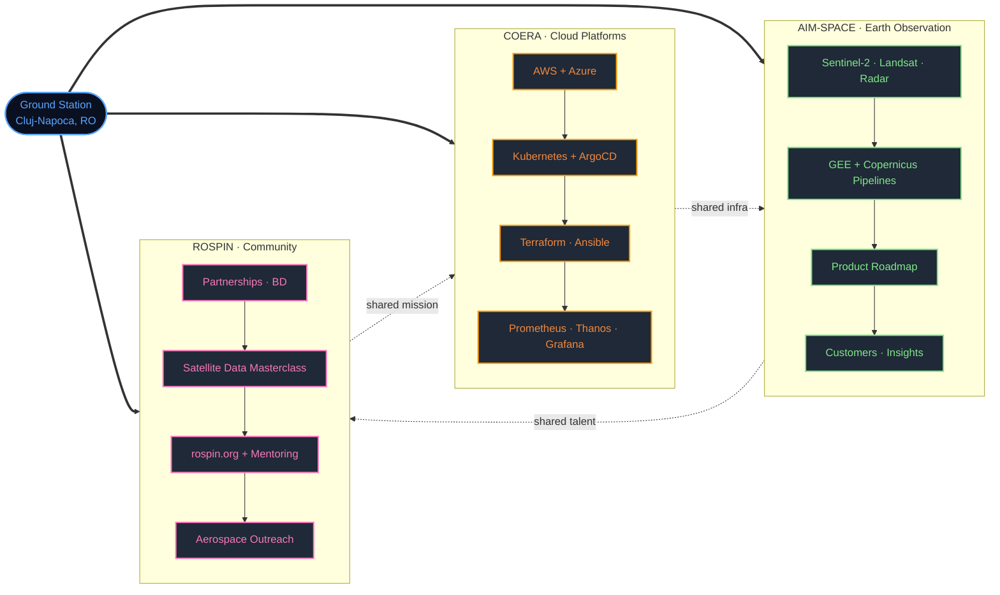

<!-- ═══════════════════════════════════════════════════════════════════════
     MISSION CONTROL · Simonel-Olimpiu David
     Cloud Infrastructure · DevOps · Earth Observation · Space Technology
     ═══════════════════════════════════════════════════════════════════════ -->

<!-- HERO BANNER -->
<a href="https://github.com/SimonelDavid">
  
</a>

<!-- TYPING TAGLINE -->
<p align="center">
  <a href="https://github.com/SimonelDavid">
    
  </a>
</p>

<!-- ORBIT METRICS -->
<p align="center">
  
  
  
  
  
</p>

---

## Mission Briefing

I'm a **Mid DevOps Engineer at COERA BC SRL** and **EO Platform Product Manager at AIM-SPACE**, operating at the intersection of cloud infrastructure and space technology. My days rotate between three orbits — **COERA** (cloud platforms and observability), **AIM-SPACE** (Earth Observation products), and **ROSPIN** (community and aerospace outreach). Currently pursuing a Master's in Distributed Systems in Internet at Babeș-Bolyai University.

```yaml
apiVersion: mission.simoneldavid.dev/v1
kind: Engineer
metadata:
  name: simonel-olimpiu-david
  labels: { role: devops, domain: space, location: romania }
spec:
  primary_orbits:
    - name: COERA BC SRL
      role: Mid DevOps Engineer
      focus: [ aws, kubernetes, terraform, observability ]
    - name: AIM-SPACE
      role: EO Platform Product Manager
      focus: [ earth-observation, product-strategy, satellite-data ]
    - name: ROSPIN
      role: Business Development Director · IT Manager
      focus: [ community, education, aerospace-outreach ]
  learning: [ distributed-systems, federated-learning, edge-ml ]
  interests: [ satellites, astronomy, cybersecurity, music, violin ]
  motto: "Let your dreams expand beyond the borders of the universe."
status: In Orbit — accepting collaboration requests.
```

---

## Daily Mission Control — The Three Orbits

<table>
  <tr>
    <td width="33%" valign="top" align="center">
      <a href="https://www.coera.ro/">
        
      </a>
      <h4>Cloud Platforms Orbit</h4>
      <p><em>Mid DevOps Engineer</em></p>
      
      <p>
        
        
        
      </p>
    </td>
    <td width="33%" valign="top" align="center">
      <a href="https://aim-space.com/">
        
      </a>
      <h4>Earth Observation Orbit</h4>
      <p><em>EO Platform Product Manager</em></p>
      
      <p>
        
        
        
      </p>
    </td>
    <td width="33%" valign="top" align="center">
      <a href="https://rospin.org/">
        
      </a>
      <h4>Community Orbit</h4>
      <p><em>Business Development Director · IT Manager</em></p>
      
      <p>
        
        
        
      </p>
    </td>
  </tr>
</table>

### Orbital Schedule — a typical weekday (UTC+2)

```bash
# ~/.config/mission/crontab
#  m  h   activity
   00 07  *  *  *   wake && coffee --strength=high
   30 08  *  *  1-5 coera:standup      # COERA · cloud platforms standup
   00 09  *  *  1-5 coera:deep-work    # terraform, k8s, observability, on-call
   00 13  *  *  1-5 lunch --no-slack
   00 14  *  *  1-5 aim-space:product  # AIM-SPACE · EO platform, roadmap, data
   00 18  *  *  1-5 rospin:community   # ROSPIN · partnerships, mentoring, events
   00 21  *  *  *   learn || play(violin, guitar) || stargaze
   00 23  *  *  *   shutdown --graceful
```

### Mission Architecture — how the orbits connect



### `kubectl get missions --all-namespaces`

```console
$ kubectl get missions --all-namespaces -o wide
NAMESPACE    NAME                                     STATUS     AGE    OWNER       PRIORITY
coera        ReplicaSet/k8s-platform                  Running    2y     devops      P0
coera        CronJob/observability-stack              Running    2y     devops      P0
coera        Deployment/ci-cd-pipelines               Running    2y     devops      P1
aim-space    Deployment/eo-platform                   Deploying  6mo    product     P0
aim-space    Job/satellite-data-masterclass           Running    1y     education   P1
aim-space    Pod/federated-learning-edge-ml           Pending    3mo    research    P2
rospin       StatefulSet/partnerships-bd              Running    new    leadership  P0
rospin       Deployment/rospin.org                    Running    3y     it-manager  P1
rospin       CronJob/aerospace-outreach-events        Scheduled  4y     community   P1
personal     Pod/masters-distributed-systems          Running    2y     self        P0
personal     Job/violin-practice                      CronJob    ∞      self        P3
```

---

## Interactive Terminal — About Me

<table>
  <tr>
    <td width="50%" valign="top">
      <h3 align="center">Quick Facts</h3>
      <p align="center">
        
      </p>
    </td>
    <td width="50%" valign="top">
      <h3 align="center">Guess the Stack</h3>
      <p align="center">
        
      </p>
    </td>
  </tr>
</table>

<details>
  <summary><b>Level-1 — Cloud &amp; Infrastructure Trivia</b></summary>

  <br/>

  **Q1.** What tool turns a Git commit into a running cluster change without a `kubectl apply`?
  <details><summary>answer</summary>ArgoCD — GitOps reconciliation loop.</details>

  **Q2.** Which three pillars of observability do I work with daily?
  <details><summary>answer</summary>Metrics (Prometheus/Thanos), Logs (OpenSearch + FluentBit + Logstash), Traces.</details>

  **Q3.** If you need multi-region, long-retention Prometheus without running out of disk, what do you reach for?
  <details><summary>answer</summary>Thanos — global query view and object-store backed blocks.</details>

  **Q4.** Which AWS service do you NOT want to scale to zero if uptime matters?
  <details><summary>answer</summary>NAT Gateway — it's zonal, and losing it silently breaks egress.</details>

</details>

<details>
  <summary><b>Level-2 — Earth Observation &amp; Space Trivia</b></summary>

  <br/>

  **Q1.** Which ESA mission studies exoplanet atmospheres via transit spectroscopy?
  <details><summary>answer</summary>Ariel — I worked on noise analysis during the ESA Datalabs Ariel Hackathon 2025.</details>

  **Q2.** Landsat vs Copernicus — which constellation gives you a 5-day global revisit?
  <details><summary>answer</summary>Copernicus Sentinel-2 (a pair of satellites).</details>

  **Q3.** What do Urban Heat Island cold spots tell urban planners?
  <details><summary>answer</summary>Where green infrastructure is working — and where a city is quietly cooling itself.</details>

  **Q4.** Why SAR (radar) instead of optical imagery for border monitoring?
  <details><summary>answer</summary>SAR sees through clouds and works at night — critical for 24/7 critical-infrastructure surveillance.</details>

</details>

<details>
  <summary><b>Level-3 — Product &amp; Leadership Trivia</b></summary>

  <br/>

  **Q1.** Most important question to ask before adding a feature to an EO platform?
  <details><summary>answer</summary>"What decision does this enable a customer to make, and how often?"</details>

  **Q2.** Worst failure mode for a community organisation growing fast?
  <details><summary>answer</summary>No succession plan — when founders leave, institutional memory leaves with them.</details>

</details>

---

## Stack · Ground Segment

<table>
  <tr>
    <td valign="top" width="25%">
      <h4 align="center">Languages</h4>
      <p align="center">
        
      </p>
    </td>
    <td valign="top" width="25%">
      <h4 align="center">Cloud &amp; Infra</h4>
      <p align="center">
        
      </p>
    </td>
    <td valign="top" width="25%">
      <h4 align="center">Observability</h4>
      <p align="center">
        
      </p>
    </td>
    <td valign="top" width="25%">
      <h4 align="center">Data &amp; Web</h4>
      <p align="center">
        
      </p>
    </td>
  </tr>
</table>

<details>
  <summary><b>Detailed badge view</b></summary>

  <br/>

  **Languages**
  
  
  
  
  

  **Cloud &amp; DevOps**
  
  
  
  
  
  
  
  
  

  **Monitoring &amp; Observability**
  
  
  
  
  
  
  

  **Earth Observation &amp; Space**
  
  
  
  
  

  **Web Technologies**
  
  
  

</details>

---

## Flight Log — Experience

| Role | Organisation | Period |
| --- | --- | --- |
| Mid DevOps Engineer | COERA BC SRL | Jan 2026 — Present |
| Advanced Junior DevOps Engineer | COERA BC SRL | Jul 2025 — Jan 2026 |
| Junior DevOps Engineer | COERA BC SRL | Jun 2024 — Jul 2025 |
| Trainee DevOps Engineer | COERA BC SRL | Oct 2022 — Jun 2024 |
| DevOps Intern | COERA BC SRL | Jul 2022 — Aug 2022 |
| EO Platform Product Manager | AIM-SPACE | Nov 2025 — Present |
| Software Engineer | AIM-SPACE | Mar 2023 — Nov 2025 |

<details>
  <summary><b>Role highlights</b></summary>

  - **Mid DevOps Engineer @ COERA BC SRL** — Designing and operating AWS and Kubernetes infrastructure with CI/CD automation and infrastructure-as-code.
  - **Advanced Junior DevOps Engineer @ COERA BC SRL** — Improved cloud reliability through Terraform-based automation and production monitoring.
  - **Junior DevOps Engineer @ COERA BC SRL** — Built Kubernetes platforms and centralised monitoring to improve deployment efficiency.
  - **Trainee DevOps Engineer @ COERA BC SRL** — Supported cloud automation and CI/CD using Terraform, Ansible, and Jenkins.
  - **DevOps Intern @ COERA BC SRL** — Introduced to cloud and DevOps practices through Azure-based deployments.
  - **EO Platform Product Manager @ AIM-SPACE** — Leading an Earth Observation platform by aligning satellite data capabilities with product strategy.
  - **Software Engineer @ AIM-SPACE** — Developed satellite data processing and geospatial analysis solutions.

</details>

---

## Constellation — Volunteering &amp; Community

- **Business Development Director @ ROSPIN** *(Apr 2026 — Present)* — Leading ROSPIN's growth strategy and partnerships.
- **Satellite Data Processing Masterclass Project Manager @ ROSPIN** *(Oct 2024 — Present)* — Built and manages a satellite data course with Babeș-Bolyai University.
- **IT Manager @ ROSPIN** *(Sep 2022 — Present)* — Leads website development and mentors junior developers in WordPress, cPanel, and React.
- **PR Coordinator &amp; Aerospace Mentor @ Romanian Science Festival** *(Apr 2024 — Dec 2024)* — Led outreach and hands-on space activities for children.
- **Community Manager @ ROSPIN** *(Sep 2022 — Jan 2024)* — Organised large-scale space education events across 11 cities in Romania.
- **ROSPIN School Project Manager** *(Jan 2022 — Sep 2022)* — Led the inaugural edition with 300 students on space science and technology.
- **Cluj-Napoca Ambassador @ ROSPIN** *(Oct 2021 — Sep 2022)* — Built and led a community of space enthusiasts, organising regular networking events with industry experts.
- **Volunteer — Projects Department @ Asociația Studenților Fizicieni UBB** *(Oct 2022 — Sep 2023)* — Planned and executed STEM events and workshops with high participant engagement.
- **Volunteer @ Euroavia Cluj-Napoca** *(Oct 2022 — Sep 2023)* — Organised aerospace networking events, workshops, and industry-focused discussions.
- **HR Volunteer @ HERMES Society** *(Oct 2021 — Sep 2023)* — Supported recruitment and coordinated the Hermes Hackathon.
- **Backstage Volunteer @ UNTOLD Festival** *(Aug 2022)* — Logistical and operational backstage support: artist schedules, equipment setup, event execution.

---

## Payload — Selected Projects &amp; Achievements

### EOSec — Defense-X Hackathon Winner *(Dec 2025, Sibiu)*
Co-developed a satellite-based monitoring platform using multispectral and radar imagery to detect critical infrastructure and border changes.

### ESA Datalabs Ariel Hackathon 2025 *(Jan 2025, Madrid)*
Built a machine-learning solution to analyse instrument noise and improve signal clarity for the ESA Ariel exoplanet mission.

### Erasmus+ Programs
- *"Be Unique"* (Antalya, Turkey, 2019) — Social inclusion and empowerment initiatives.
- *"Synergy for Renewal"* KA21 (Vilnius, Lithuania, 2018) — Community renewal and sustainability.

---

## Repositories in Orbit

<p align="center">
  <a href="https://github.com/SimonelDavid/HeatIslands">
    
  </a>
  <a href="https://github.com/Romanian-Space-Initiative/Landsat-vs-Copernicus">
    
  </a>
</p>
<p align="center">
  <a href="https://github.com/Romanian-Space-Initiative/Geospatial-Intelligence-Workshop">
    
  </a>
  <a href="https://github.com/SimonelDavid/WhatsAppMessageAutomation">
    
  </a>
</p>

- **[Autonomous Heat Island Detection Tool](https://github.com/SimonelDavid/HeatIslands)** — Docker, Terraform, GEE, Java, Python, Nginx, Grafana, Prometheus.
- **[Landsat vs Copernicus](https://github.com/Romanian-Space-Initiative/Landsat-vs-Copernicus)** — ROSPIN workshop on the advantages and tradeoffs of Copernicus and Landsat data. Python, GEE, Copernicus Hub.
- **[Geospatial Intelligence Workshop](https://github.com/Romanian-Space-Initiative/Geospatial-Intelligence-Workshop)** — Deploying a web app that processes satellite data. Docker, Shell, Python, GEE, Copernicus Hub.
- **[SpacedIn Platform](https://spacedin.getlearnworlds.com/)** — A platform to educate students on the lifecycle of space missions.
- **[ROSPIN Website](https://rospin.org/)** — Main website of ROSPIN.
- **[WhatsApp Automation Tool](https://github.com/SimonelDavid/WhatsAppMessageAutomation)** — Automation tool supporting ROSPIN staff. Python.

---

## Downlink — Publications

- **ROSPIN Satellite Data Processing Masterclass** — *5th SSEA Symposium, Munich, Apr 2026*
- **Federated Learning for On-Orbit EO Analytics in Military Satellite Constellations** — *5th EDT Conference, Sibiu, Mar 2026*
- **Top Cities in Romania by Urban Heat Island Cold Spots (2018–2022)** — *ROSPIN, AIM-SPACE, Nov 2024*
- **Top Cities in Romania by Urban Heat Island Hotspots (2018–2022)** — *ROSPIN, AIM-SPACE, Nov 2024*
- **Wondering for Freedom** — *Independent game project inspired by John Stuart Mill's On Liberty, Apr 2021*

---

## Training Program — Education

- **Master's in Distributed Systems in Internet** — Babeș-Bolyai University *(2024 — Ongoing)*
- **Bachelor of Science in Computer Science** — Babeș-Bolyai University *(2021 — 2024)*

---

## Crew Comms — Languages

| Language | Level |
| --- | --- |
| Romanian | Native |
| English  | C1 |
| German   | Intermediate |

---

## Flight Crew — Soft Skills

Leadership · Teamwork · Communication · Research · Creativity · Problem-Solving · Decision-Making · Strategic Thinking · Adaptability

---

## Side Payloads — Other Interests

Machine Learning · Cybersecurity · Space Exploration · Satellites · Astronomy · Video Games · Open-Source · Music · Violin · Guitar · Contemporary Dance

---

## Telemetry — GitHub Activity

<p align="center">
  
  
</p>

<p align="center">
  
  
</p>

<p align="center">
  
</p>

<p align="center">
  
  
</p>

<p align="center">
  
</p>

<p align="center">
  
</p>

### Contribution Snake — Eating the Orbit

<p align="center">
  
</p>

---

## Uplink — Connect

<p align="center">
  <a href="https://www.linkedin.com/in/simoneldavid/">
    
  </a>
  <a href="https://simoneldavid.github.io/Personal-website">
    
  </a>
  <a href="mailto:simoneldavid17@gmail.com">
    
  </a>
  <a href="https://github.com/SimonelDavid">
    
  </a>
  <a href="https://rospin.org/">
    
  </a>
</p>

---

<p align="center">
  
</p>


